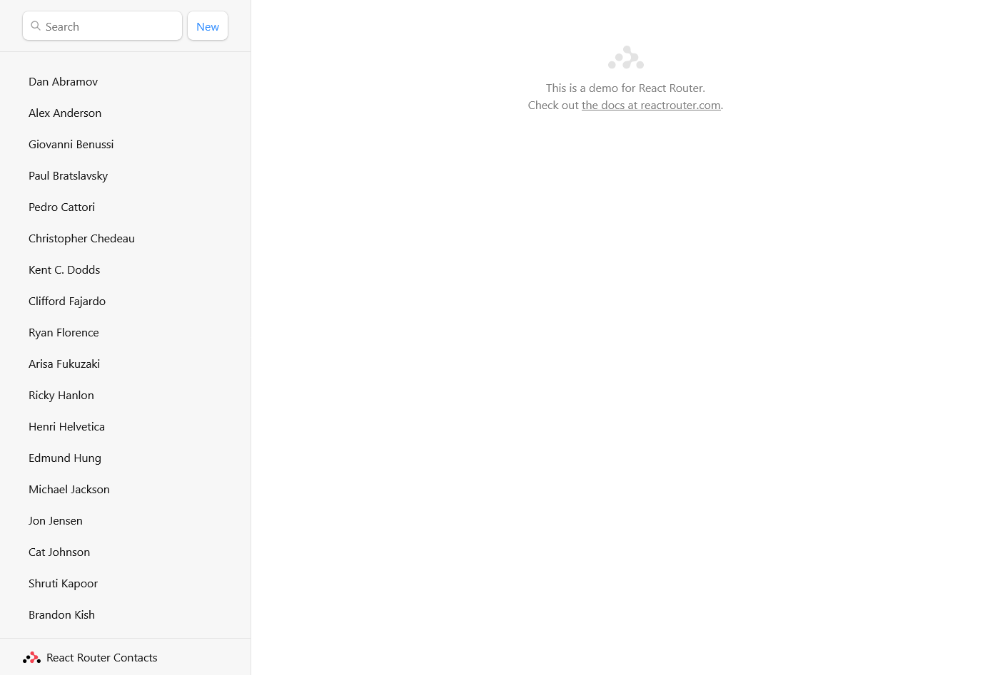

# Client-side Routing for a Simple Contact App with React-Router v6

## 📗 Table of Contents

- [📖 Overview](#about-project)
  - [Project Objectives](#project-objectives)
  - [🛠 Built With](#built-with)
    - [Tech Stack](#tech-stack)
    - [Key Features](#key-features)
  - [🚀 Live Demo](#live-demo)
- [💻 Getting Started](#getting-started)
  - [Setup](#setup)
  - [Prerequisites](#prerequisites)
  - [Install](#install)
  - [Run tests](#run-tests)
  - [Deployment](#deployment)
- [👥 Authors](#authors)
- [🔭 Future Features](#future-features)
- [🤝 Contributing](#contributing)
- [⭐️ Show your support](#support)
- [🙏 Acknowledgements](#acknowledgements)
- [📝 License](#license)

## 📖 Overview 

This repository showcases a basic contact app built upon the principles learned from the official React Router tutorial. Through this project, you'll experience:

- The advantage of managing contact app states using React-Router hooks as opposed to standard React hooks.
- An illustrative guide to client-side routing in React, tailored for a contact management scenario.
- Design techniques for intuitive user dashboards in a contact app.

To get a quick overview, don't miss the [video summary](https://www.loom.com/share/01ea97cc40404fd9924ff03044543eca) highlighting the app's features and the benefits of using React-Router v6!

### Project Objectives 

- **Simplicity and Usability:** Develop an intuitive interface for easy contact management and navigation.
- **Efficient State Management:** Utilize React-Router hooks for smooth transitions and efficient data handling.
- **Robust Client-Side Routing:** Leverage React-Router v6 for client-side routing mechanisms tailored for contact apps.
- **Responsive Design:** Ensure cross-device compatibility and accessibility.
- **User Dashboard:** Offer a comprehensive dashboard for contact overview with search, sort, and filter capabilities.
- **Contact CRUD Operations:** Enable creating, reading, updating, and deleting contacts with seamless routing.
- **Error Handling:** Implement mechanisms for handling routing errors and guiding users appropriately.
- **Feedback and Iteration:** Continuously improve based on user feedback.

## Installation

## 🛠 Built With 

### Tech Stack 

- [react](https://react.dev/)
- [npm](https://www.npmjs.com/)
- [Git](https://git-scm.com/)
- [GitHub](https://github.com)
- [Stylelint](https://stylelint.io/)
- [ESLint](https://eslint.org/)
- [VSCode](https://code.visualstudio.com/)
- [react router](https://reactrouter.com/)
- [vite](https://vitejs.dev/)
- [localforage](https://localforage.github.io/localForage/)
- [match-sorter](https://github.com/kentcdodds/match-sorter)
- [prop-types](https://www.npmjs.com/package/prop-types)
- [sort-by](https://www.npmjs.com/package/sort-by)
- [gh-pages](https://www.npmjs.com/package/gh-pages)

### Key Features 

- [x] Client-side routing.

## 🚀 Live Demo 

> [Live Demo Link](https://fmanimashaun.github.io/contact-app/)

  

## 💻 Getting Started 

- [Optional] Install git bash to your machine to enable you to clone this repo.
- install Visual Studio to be able to host a local live version.
- Install a browser to view the local live version.

To get a local copy up and running follow these simple example steps.
### Setup 

- Open your GitHub account the repository's [link](https://github.com/fmanimashaun/contact-app)

### Prerequisites 

- Internet connection
- A github account
### Install 

- copy the repo's link and clone it by writing `git clone https://github.com/fmanimashaun/bookstore-cms.git` on your git bash terminal.
- `npm install` to install the dependencies.

### Run tests 

- You can check for errors by running linter tests found in the github flows.

### Deployment 

- run `npm run start` to run it locally.

## Authors 

👤 **Engr. Animashaun Fisayo**

- [GitHub](https://github.com/fmanimashaun)
- [Twitter](https://twitter.com/fmanimashaun)
- [LinkedIn](https://www.linkedin.com/in/fmanimashaun/)
- [Website](https://fmanimashaun.com)

## 🔭 Future Features 

- [ ] add user authenitcation for private contact management.

## 🤝 Contributing 

Contributions, issues, and feature requests are welcome!

Feel free to check the [issues page](../../issues/).

## ⭐️ Show your support 

Give a ⭐️ if you like this project!

## 🙏 Acknowledgements 

- [React-router team](https://reactrouter.com/)

## 📝 License 
This project is [MIT](./LICENSE) licensed.
